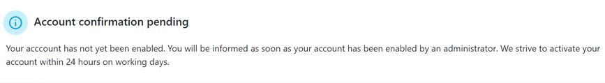
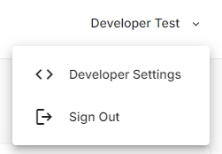
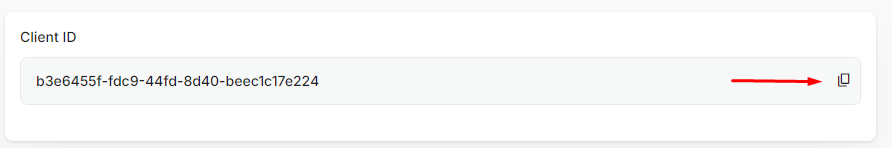
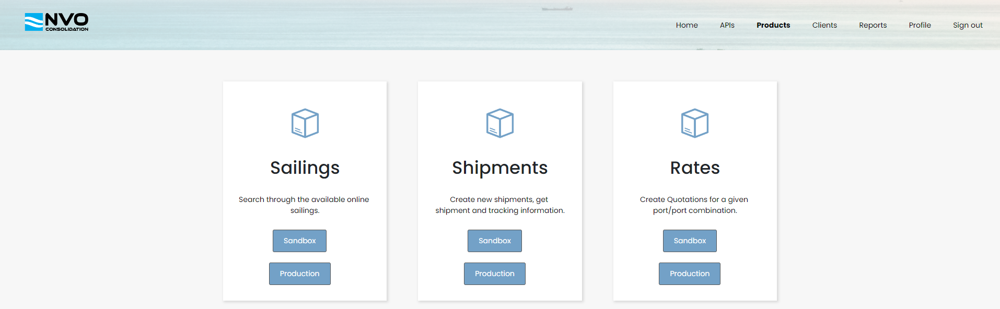
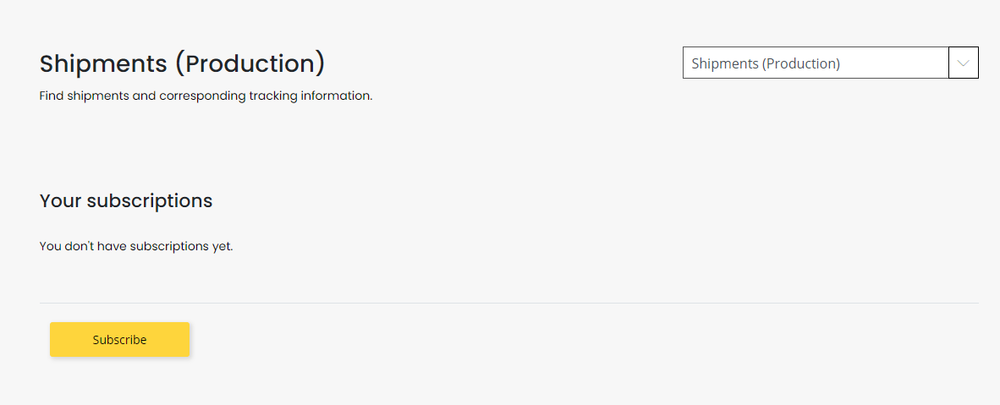
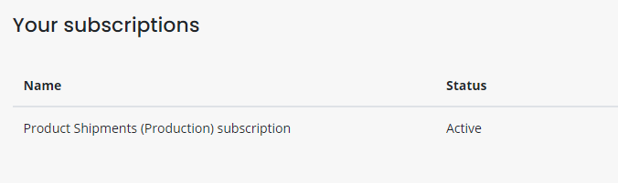
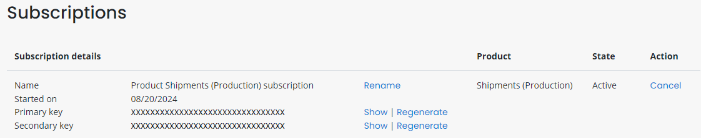
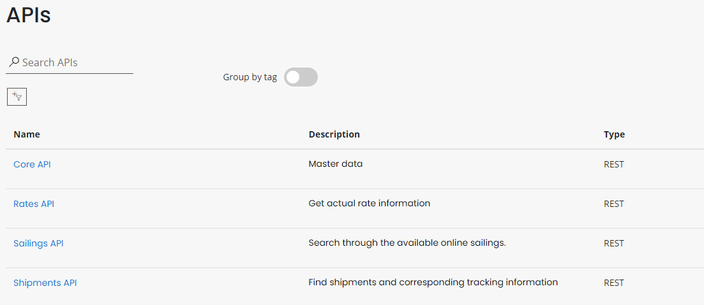

# Getting Started

This guide offers step-by-step instructions for sending requests to our APIs. Please note that you won't be able to proceed with this guide if your account has not yet been enabled. If your account is not enabled, the following notification will be displayed in the [API portal](https://api-portal.nvoworldwide.com/).



# 1. Register a client

To obtain access tokens, you must first register a client. Begin by visiting the [NVOGO portal](https://nvogo.nvoworldwide.com/) and clicking the **Developers Settings** button in the top-right menu. If you do not see this option, try logging out and back in. If the menu item remains hidden, please contact it@vbemsagroup.com for assistance.



This will open the API Management Client Settings screen, where you'll find a Client ID that you can copy. You'll need this Client ID later.



# 2. Subscribe to a product

To send requests to an API, a subscription key is required. You can obtain this key by subscribing to a product. Navigate to the [**Products**](https://api-portal.nvoworldwide.com/products) page within the API portal.



Select the desired product and choose either **SandBox**, in which case your application will communicate with the [testing environment](https://nvogo-testing.nvoworldwide.com), whereas choosing **Production** will direct all communication to the [production environment](https://nvogo.nvoworldwide.com).



Subscribe to the product by clicking the yellow **Subscribe** button. After subscribing, the subscription status should show as **Active**.



Once subscribed, you can find the subscription key on the [**Profile**](https://api-portal.nvoworldwide.com/profile) page, which displays all your subscriptions and their associated keys.



Click the **Show** button to reveal the key. With this key in hand, you're ready to retrieve tokens and make requests!

# 3. Retrieve a access token

Now that you have all the necessary information, you first need to retrieve an access token. Ensure you provide the correct **scope** to obtain a valid access token. The scope depends on the API being called:

1. https://nvogo.onmicrosoft.com/shipments-api/shipments-api - used for the **Shipments API**
2. https://nvogo.onmicrosoft.com/rates-api/rates-api - used for the **Rates API**
3. https://nvogo.onmicrosoft.com/sailings-api/sailings-api - used for the **Sailings API**
4. https://nvogo.onmicrosoft.com/core-api/core-api - used for the **Core API**

in addition to this, you'll need your client ID, along with your username (email) and password. Then you can use the following C# code to obtain an access token:

```c#
using Microsoft.Identity.Client;

var authority = "https://nvogo.b2clogin.com/tfp/nvogo.onmicrosoft.com/B2C_1_ROPC/v2.0/";
var scope = "https://nvogo.onmicrosoft.com/shipments-api/shipments-api";
var clientId = "<YOUR-CLIENT-ID>";
var userName = "<YOUR-USERNAME>";
var password = "<YOUR-PASSWORD>";

var scopes = new string[] { scope };

var app = PublicClientApplicationBuilder.Create(clientId)
    .WithB2CAuthority(authority)
    .Build();

AuthenticationResult result = await app
    .AcquireTokenByUsernamePassword(scopes, userName, password)
    .ExecuteAsync();

Console.WriteLine($"Retrieved access token: {result.AccessToken}");
```

This code will generate an access token that is valid for **60 minutes**. You can re-execute the request or use a refresh token to obtain a new access token. Note that the **Microsoft.Identity.Client** NuGet package handles refresh tokens automatically. If you prefer to manage refresh tokens manually, keep in mind that they are valid for 14 days. More information on acquiring and using refresh tokens can be found [here](https://learn.microsoft.com/en-us/azure/active-directory-b2c/add-ropc-policy?tabs=app-reg-ga&pivots=b2c-user-flow#test-the-ropc-flow).

If you wish to retreive a token without using C# or the **Microsoft.Identity.Client** package, you can use https://nvogo.b2clogin.com/nvogo.onmicrosoft.com/B2C_1_ROPC/oauth2/v2.0/token endpoint to retrieve a access token. Please note that you have to pass in the following parameters in the body of the request:

- grant_type: this has to be **password**
- client_id: your Client ID retrieved in step 1
- scope: your desired scope
- username: your username
- password: your password

For extra information about authorization, please visit the [discovery document](https://nvogo.b2clogin.com/nvogo.onmicrosoft.com/B2C_1_ROPC/v2.0/.well-known/openid-configuration). This holds all the information needed to authorize.

# 4. Execute a request

With a valid access token and subscription key, you are ready to make a request. The following code demonstrates how to perform a **GET** request to the **Shipments API** to retrieve a shipment by its ID:

```c#
using System.Net.Http.Headers;

var shipmentId = "<YOUR-SHIPMENT-ID>";
var accessToken = "<YOUR-ACCESS-TOKEN>";
var apimSubscriptionKey = "<YOUR-SUBSCRIPTION-KEY>";
var requestUrl = $"https://api.nvoworldwide.com/shipments/api/Shipments/{shipmentId}";

var apiClient = new HttpClient();
apiClient.DefaultRequestHeaders.Add("Ocp-Apim-Subscription-Key", apimSubscriptionKey);
apiClient.DefaultRequestHeaders.Authorization = new AuthenticationHeaderValue("Bearer", accessToken);

var response = await apiClient.GetAsync(requestUrl);

if (!response.IsSuccessStatusCode)
{
    Console.WriteLine(response.ToString());
}
else
{
    var apiResponse = await response.Content.ReadAsStringAsync();
    Console.WriteLine(apiResponse);
}

```

# More samples

This repository includes additional examples in the **Samples** folder, such as the **QuotationRequestSample**, which demonstrates how to create a quote using the **Rates API**.

# More docs

To view all available endpoints and their required request bodies, navigate to the [**APIs**](https://api-portal.nvoworldwide.com/apis) page within the API portal. This page displays a list of all available APIs. Clicking on any Api will open a detailed screen where you can see all endpoints and their corresponding request bodies.


